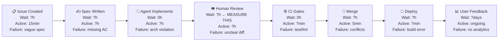

# Copilot Agent Starter Template — Complete Paste Book
> 25 files. DORA AI Capabilities Model + DORA 2025 State of AI-assisted Software Development.
> Every file includes the DORA research basis for its existence.
> Replace all [PLACEHOLDER] text before use.

---


======================================================================
## FILE: README
### Path: `README.md`
======================================================================

# [PROJECT NAME]

> **A PM-directed, Copilot-agent-implemented product.**
> This repository uses the [Copilot Agent Starter Template](https://github.com/[YOUR-ORG]/copilot-agent-starter).
> Read `TEMPLATE-DESIGN.md` to understand every design decision.

---

## Quick Start for PMs

1. **Read `docs/AI_POLICY.md`** — understand what AI does and doesn't do on this project
2. **Complete `docs/TEAM_ARCHETYPE.md`** — run the DORA archetype self-assessment before writing issues
3. **Complete `docs/VALUE_STREAM_MAP.md`** — map your idea→deploy flow before starting features
4. **Write your first issue** using `.github/ISSUE_TEMPLATE/feature.md`
5. **Read `docs/GOLDEN_PATH.md`** — understand the 10-step workflow that every feature follows

---

## Quick Start for Developers

```bash
git clone [repo-url]
cd [project-name]
npm install

# Verify all gates pass on a clean checkout
npm run preflight

# See current metrics
npm run metrics
```

---

## AI Development Workflow

Every feature follows the Golden Path in `docs/GOLDEN_PATH.md`:

```
PM writes issue → Assign to Copilot → Agent implements + tests → Draft PR
→ @review-agent pre-screens → Human reviews → CI gates pass → Human merges → Auto-deploy
```

**Key commands:**
```bash
npm run preflight    # lint + typecheck + tests (run before every push)
npm run pr-ready     # preflight + "ready to push" confirmation
npm run metrics      # weekly metrics snapshot (rework rate, coverage, etc.)
```

---

## Agent Specialists

| Agent | Call with | Purpose |
|---|---|---|
| Review agent | `@review-agent` | Pre-screen PRs against architecture rules |
| Test agent | `@test-agent` | Write tests, analyse coverage gaps |
| Docs agent | `@docs-agent` | Generate/update living documentation |
| Security agent | `@security-agent` | Review security-sensitive code |

Full agent profiles in `.github/agents/`.

---

## Key Documents

| Document | Purpose |
|---|---|
| `AGENTS.md` | Universal agent instructions — all agents read this |
| `docs/GOLDEN_PATH.md` | The 10-step idea→deploy workflow |
| `docs/PROMPT_LIBRARY.md` | Tested prompts for every repeating task |
| `docs/AI_POLICY.md` | AI policy and psychological safety norms |
| `docs/ARCHITECTURE.md` | Layer boundaries (ESLint-enforced) |
| `docs/API_SURFACE.md` | All public service and utility functions |
| `docs/KNOWN_LIMITATIONS.md` | Known issues — agents do not make these worse |
| `docs/METRICS.md` | Rework rate, change failure rate, DevEx targets |
| `docs/RUNBOOKS.md` | Emergency rollback, feature disable, weekly review |
| `docs/TEAM_ARCHETYPE.md` | DORA archetype self-assessment |
| `TEMPLATE-DESIGN.md` | Why every file exists (DORA research basis) |

---

## Setup Checklist for New Projects

Before writing the first issue:

- [ ] Search and replace all `[PLACEHOLDER]` text throughout the template
- [ ] Fill in `AGENTS.md` — project identity, stack, architecture rules
- [ ] Fill in `.github/copilot-instructions.md` — project-specific context
- [ ] Create `src/types/index.ts` with JSDoc on every type
- [ ] Create `docs/ARCHITECTURE.md` with your actual layer definitions
- [ ] Complete `docs/TEAM_ARCHETYPE.md` — runs before Phase 1
- [ ] Complete `docs/VALUE_STREAM_MAP.md` — runs before Phase 2
- [ ] Configure CI: update `.github/workflows/ci-quality.yml` test/lint commands
- [ ] Test `npm run preflight` — ensure it passes on a clean repo
- [ ] Enable Copilot coding agent in GitHub org settings
- [ ] Set branch protection: require CI passing + human approval on `main`

---

## DORA Research Basis

This template is grounded in:
- **DORA 2025** — *State of AI-assisted Software Development*
- **DORA AI Capabilities Model** companion report (Dec 2025)

The central finding this template is designed around:
> "AI adoption is linked to higher software delivery throughput AND increases instability.
> Without robust control systems — strong automated testing, mature version control practices,
> and fast feedback loops — an increase in change volume leads to instability."


======================================================================
## FILE: TEMPLATE-DESIGN
### Path: `TEMPLATE-DESIGN.md`
======================================================================

# Copilot Agent Starter Template — Design Rationale

> This document explains **why** every file in this template exists and which DORA research
> principle it implements. Read this before customising the template for your project.
>
> Research sources:
> - **DORA 2025** — *State of AI-assisted Software Development* (2025)
> - **DORA AI Cap** — *AI Capabilities Model* companion report (Dec 2025)
> - **GitHub Docs** — *Best practices for Copilot coding agent* (2025–2026)
> - **GitHub Blog** — *How to write a great agents.md: Lessons from 2,500+ repos* (Nov 2025)

---

## The Central DORA 2025 Warning

> "AI adoption is linked to higher software delivery throughput AND increases instability.
> Without robust control systems — strong automated testing, mature version control practices,
> and fast feedback loops — an increase in change volume leads to instability."

This is the founding constraint of the entire template. Every file exists to either
**accelerate** AI output or **control** AI output. Neither alone is sufficient.

---

## Template File Map

| File | DORA Capability | What It Does |
|---|---|---|
| `AGENTS.md` | AI Cap 3 — Context Engineering | Universal agent instruction file; loaded by all agents |
| `.github/copilot-instructions.md` | AI Cap 3 | Copilot-specific context index; auto-loaded by VS Code |
| `.github/agents/docs-agent.md` | AI Cap 2 — Prompt Engineering | Specialist for documentation generation |
| `.github/agents/test-agent.md` | AI Cap 2 | Specialist for test generation |
| `.github/agents/review-agent.md` | DORA 2025 — Review Speed | Specialist for code review (REVIEW-01) |
| `.github/agents/security-agent.md` | AI Cap 1 — AI Policy | Specialist for security review |
| `.github/instructions/feature.instructions.md` | AI Cap 3 | Scoped to src/**; injected for feature work |
| `.github/instructions/testing.instructions.md` | AI Cap 3 | Scoped to tests/**; injected for test work |
| `.github/PULL_REQUEST_TEMPLATE.md` | DORA 2025 — Review Speed | Structured AI-Assisted Review Block (REVIEW-01) |
| `.github/workflows/ci-quality.yml` | DORA 2025 — Control Systems | CI gate with PR size blocking (INSTAB-01) |
| `.github/workflows/doc-freshness.yml` | DORA 2025 — Living Docs | Posts reminder when services change without doc update |
| `docs/ARCHITECTURE.md` | DORA 2025 — Loosely Coupled | Layer boundaries enforced by ESLint (ARCH-01) |
| `docs/GOLDEN_PATH.md` | DORA 2025 — Platform Eng | 10-step idea→deploy workflow (PLAT-02) |
| `docs/PROMPT_LIBRARY.md` | AI Cap 2 — Prompt Engineering | Versioned task-specific prompt templates (AIOPS-04) |
| `docs/METRICS.md` | DORA 2025 — Rework Rate | Rework rate, change failure rate, PR revision rate (METRICS-02) |
| `docs/DEVEX_LOG.md` | DORA 2025 — DevEx | Monthly 5-dimension self-assessment (DEVEX-01) |
| `docs/TEAM_ARCHETYPE.md` | DORA 2025 — Archetypes | Seven archetype self-assessment; tailors issue priority (AIOPS-05) |
| `docs/VALUE_STREAM_MAP.md` | DORA 2025 — VSM | Issue→deploy flow with wait times; identifies bottleneck (VSM-01) |
| `docs/KNOWN_LIMITATIONS.md` | AI Cap 3 — Context | What agents must not make worse (DOCS-02) |
| `docs/API_SURFACE.md` | AI Cap 3 — Context | All public service/util functions; Copilot reads before generating (DOCS-02) |
| `docs/CHANGE_IMPACT_MAP.md` | AI Cap 3 — Context | Cross-file impact map; prevents Copilot omissions (DOCS-02) |
| `docs/RUNBOOKS.md` | DORA 2025 — Instability | Emergency rollback, feature disable, weekly review (INSTAB-01) |
| `docs/AI_POLICY.md` | AI Cap 1 — AI Policy | Clear AI stance; psychological safety (PSYCH-01) |
| `scripts/weekly-metrics.sh` | DORA 2025 — Rework Rate | Single-screen metrics summary (METRICS-02) |
| `.vscode/settings.json` | AI Cap 3 — Context Eng. | Auto-loads copilot-instructions.md in every session |

---

## The Seven DORA AI Capabilities (and how this template addresses each)

### Capability 1 — Clarify AI Policies
**Finding:** Ambiguity around AI use harms both adoption and psychological safety.
**Template response:** `docs/AI_POLICY.md` — explicit stance on what AI does/doesn't do, who reviews, data handling.

### Capability 2 — Prompt Engineering as Core Skill
**Finding:** "The modern engineer's value is in prompt engineering, solution architecture, and validating AI outputs — not just writing code."
**Template response:** `docs/PROMPT_LIBRARY.md` — versioned, categorised templates for every repeating task type. `TEMPLATE_DESIGN.md` explains the why.

### Capability 3 — AI-Accessible Internal Data (Context Engineering)
**Finding:** "Moving beyond simple prompts to securely connecting AI tools to your internal documentation and codebases" — Google's #2 "where to start" recommendation.
**Template response:** `AGENTS.md` context index, `.vscode/settings.json` auto-load, `docs/API_SURFACE.md`, `docs/KNOWN_LIMITATIONS.md`, `docs/CHANGE_IMPACT_MAP.md`.

### Capability 4 — Mature Version Control
**Finding:** Strong version control practices are prerequisites for safe AI adoption; without them AI increases instability.
**Template response:** Branch protection in CI, conventional commits standard, PR size blocking at 400 lines (INSTAB-01), large-pr-approved label gate.

### Capability 5 — Small Batches / Shift Left on Quality
**Finding:** Small batches are the most effective structural countermeasure to AI-induced instability.
**Template response:** PR size block in CI, TDD requirement in golden path, failing test commit before implementation commit.

### Capability 6 — Fast Feedback Loops
**Finding:** Fast feedback is the #1 platform capability correlated with positive DevEx.
**Template response:** CI < 4 min target, human-readable CI output, `npm run preflight` (lint+typecheck+test in one command), `docs/DEVEX_LOG.md` Feedback Speed dimension.

### Capability 7 — Internal Developer Platform
**Finding:** "Developer independence resulted in 5% productivity improvement."
**Template response:** `docs/GOLDEN_PATH.md` (one route from idea to deploy), `npm run pr-ready`, `npm run metrics`, agent specialists that reduce interruption.

---

## The Three Sequencing Rules (DORA 2025)

DORA 2025 gives explicit sequencing guidance. This template mirrors it:

```
Phase 1: Clarify AI policies → AGENTS.md, AI_POLICY.md, TEAM_ARCHETYPE.md
Phase 2: Connect AI to context → copilot-instructions.md, API_SURFACE.md, KNOWN_LIMITATIONS.md
Phase 3: Prioritise foundational practices → CI, architecture, PR process
Phase 4: Fortify safety nets → feature flags, rollback, rework rate tracking
Phase 5: Invest in platform → GOLDEN_PATH.md, agents, prompt library
Phase 6: Focus on end-users → features, then iterate
```

---

## What a Top-Team Adds Beyond This Template

This template establishes the foundation. Elite teams additionally:

1. **Run VSM before first feature** — map wait times across Issue→Deploy to find the real bottleneck before accelerating
2. **Complete team archetype assessment** — `docs/TEAM_ARCHETYPE.md` — to prioritise which controls to add first
3. **Iterate the prompt library** — add a changelog entry every time a prompt produced bad output
4. **Track DevEx monthly** — `docs/DEVEX_LOG.md` — the single leading indicator of whether the AI workflow is helping or grinding
5. **Wire feature flags from day one** — every new feature behind a flag; allows remote disable without OTA
6. **Treat rework rate as the north star metric** — not LOC, not PR count. Rework rate > 10% = stop adding features, fix instructions first


======================================================================
## FILE: AGENTS
### Path: `AGENTS.md`
======================================================================

# Agent Instructions — [PROJECT NAME]

> **Who reads this:** Every agent — GitHub Copilot coding agent, VS Code agent mode,
> Claude, Codex, and any third-party AI. This is the single authoritative source for
> how agents behave in this repository.
>
> **DORA basis:** DORA AI Capabilities Model Cap 3 (Context Engineering) + Cap 1 (AI Policy).
> Google's six "where to start" recommendations place "Connect AI to internal context"
> as the second step, immediately after clarifying AI policies.
>
> Customise every section marked **[PLACEHOLDER]** before assigning any issue to an agent.

---

## 1. AI Policy (DORA Cap 1 — Clarify AI Policies)

> DORA finding: "A clear AI stance provides psychological safety for experimentation.
> Ambiguity around AI use creates friction, reduces adoption, and harms team morale."

**Our AI stance:**
- AI agents implement. Humans decide.
- No AI-generated code merges without human review and approval.
- AI is used for: code generation, test writing, documentation, code review assistance.
- AI is NOT used for: architectural decisions, security-sensitive config, dependency additions without PM sign-off.
- Team members may decline AI on any task without justification. Human judgment overrides agent output always.

**Data policy:** [PLACEHOLDER — e.g. "No customer PII is pasted into AI prompts. Internal docs and code are acceptable context."]

---

## 2. Project Identity

**Product:** [PLACEHOLDER — e.g. "A React Native savings app for iOS and Android"]
**Stack:** [PLACEHOLDER — e.g. "TypeScript · React Native · Expo 52 · Firebase Auth + Firestore"]
**Key constraints:** [PLACEHOLDER — e.g. "Must support iOS 15+ and Android 12+. No native modules without PM approval."]

---

## 3. Context Files — Read Before Generating Any Code

> DORA Cap 3 finding: "Teams that connect AI to internal documentation and codebases
> produce architecturally correct output in fewer iterations."

Read these in order before writing code:

| Priority | File | What You Learn |
|---|---|---|
| 1 | `src/types/index.ts` | All data shapes, field constraints, valid ranges |
| 2 | `docs/ARCHITECTURE.md` | Layer boundaries — what can import from what |
| 3 | `docs/API_SURFACE.md` | Every public service and utility function |
| 4 | `docs/KNOWN_LIMITATIONS.md` | Known issues — do not make these worse |
| 5 | `docs/DATA_MODEL.md` | Database/collection structure |
| 6 | `docs/CHANGE_IMPACT_MAP.md` | Which files change when core types change |

If any of these files do not exist: note it in your PR description and do not invent their contents.

---

## 4. Architecture Rules (DORA 2025 — Loosely Coupled Architecture)

> DORA 2025 finding: "Teams working in loosely coupled architectures with fast feedback
> loops see AI gains. Those in tightly coupled systems see little or no benefit."
> ESLint enforces these boundaries. CI fails on violations.

[PLACEHOLDER — replace with your actual layer structure. Example:]

```
screens/     → UI composition only. No Firebase calls. No business logic.
components/  → Reusable UI primitives. No navigation. No services.
hooks/       → React state. Calls services. Never calls Firebase directly.
services/    → All Firestore reads/writes. All Firebase Auth calls.
utils/       → Pure functions. Stateless. No imports from any other layer.
types/       → Shared TypeScript types only. No imports.
config/      → Environment vars, feature flags. No business logic.
```

**Dependency direction:** `screens → hooks → services → (SDK)`

**NEVER violate:**
1. No Firebase SDK calls in `screens/` or `components/` — ever.
2. No business logic in screens — that belongs in `utils/`.
3. No type definitions inline — all types go in `src/types/index.ts`.
4. No `any` in catch blocks — use the typed error pattern from `src/utils/errors.ts`.
5. `utils/` is stateless — no React hooks, no imports from `services/`.

---

## 5. The PM–Agent Contract

**The workflow:**
1. PM writes a GitHub issue using the **feature issue template**
2. Issue is assigned to Copilot (or another agent)
3. Agent implements, tests, opens a **draft PR**
4. Human reviews against the PR review checklist
5. Human approves and merges — no agent merges its own PR

### What Agents MAY Do Without Asking
- Read any file in the repository
- Write to `src/`, `tests/`, `docs/`
- Create new files that follow the established file structure
- Run: `npm test`, `npm run lint`, `npm run typecheck`, `npm run build`, `npm run preflight`
- Open draft PRs
- Add or update JSDoc comments and doc files

### What Agents MUST Ask Before Doing
- Adding any new dependency (`package.json` changes)
- Changing database schema or collection structure
- Modifying `.github/workflows/` files
- Changing environment variable names
- Modifying authentication flows
- Any change touching more than 5 files simultaneously
- Any change to feature flags in production config

### What Agents Must NEVER Do
- Commit secrets, API keys, or credentials
- Modify `AGENTS.md` or `.github/copilot-instructions.md`
- Delete existing tests — even failing ones — without explicit PM instruction
- Push directly to `main` or `develop`
- Make architectural decisions (which pattern, where code lives)
- Merge their own PRs
- Apply the `large-pr-approved` label (humans only)

---

## 6. Coding Standards

[PLACEHOLDER — replace with your actual standards]

- **TypeScript strict mode.** Return types on all exported functions.
- **Naming:** PascalCase components, camelCase functions/variables, UPPER_SNAKE_CASE constants
- **Tests:** Write failing test first. Commit the failing test before writing implementation.
- **Commits:** Conventional commits — `feat:`, `fix:`, `test:`, `docs:`, `chore:`, `refactor:`
- **Coverage target:** 80% on `src/utils/` and `src/services/`

---

## 7. PR Requirements (DORA 2025 — Code Review Speed)

> DORA finding: "Teams with shorter code review times have 50% better delivery performance."
> Every PR must include a completed AI-Assisted Review Block.

Every PR opened by an agent must include in the description:

```markdown
## AI-Assisted Review Block

**What does this PR do?**
[One sentence]

**What could go wrong?**
[Top 2–3 failure modes]

**What tests cover this change?**
[List test files. If none: explain why.]

**Architecture check:**
[Confirm no layer boundary violations — or list any that exist]

**What I was NOT sure about:**
[Any judgment call. Flag for human review.]
```

---

## 8. Instability Safeguards (DORA 2025 — Control Systems)

> DORA 2025: "AI consistently increases PR size. Larger PRs = more surface area for bugs.
> Control systems must be proportionally stronger."

- **PR size limit:** 400 changed lines before CI blocks (not warns). Override requires `large-pr-approved` label from a human.
- **Feature flags:** New features go behind a feature flag in `src/config/featureFlags.ts`.
- **Rollback:** See `docs/RUNBOOKS.md` — Emergency Rollback procedure.
- **Rework rate > 10%:** Stop adding features. Update `AGENTS.md` / `copilot-instructions.md` first.

---

## 9. Metrics That Matter (DORA 2025 — Rework Rate)

> DORA 2025 added rework rate as a new core metric. It is the earliest signal that
> AI output quality is degrading or that instructions need updating.

Track monthly using `npm run metrics`:
- **Rework rate** — target < 10%. > 20% = stop features, fix instructions.
- **PR revision rate** — target < 25%.
- **CI cycle time** — target < 4 min.
- **Review turnaround** — target < 24h.

---

## 10. See Also

- `.github/copilot-instructions.md` — Copilot-specific rules (subset of this file)
- `.github/agents/` — Specialist agent profiles (`@docs-agent`, `@test-agent`, `@review-agent`, `@security-agent`)
- `docs/GOLDEN_PATH.md` — The 10-step idea→deploy workflow (use this for every feature)
- `docs/PROMPT_LIBRARY.md` — Tested, versioned prompts for every repeating task
- `docs/AI_POLICY.md` — Full AI policy and psychological safety norms
- `docs/TEAM_ARCHETYPE.md` — DORA archetype self-assessment (run before Phase 1)


======================================================================
## FILE: .github/copilot-instructions
### Path: `.github/copilot-instructions.md`
======================================================================

# Copilot Instructions — [PROJECT NAME]

> Loaded automatically for every Copilot Chat and agent session in this repository.
> For full rules and rationale see `AGENTS.md`.
> VS Code auto-loads this via `.vscode/settings.json`.

---

## Context Files — Read These First

Before writing any code, read:

1. `src/types/index.ts` — all data shapes and constraints
2. `docs/ARCHITECTURE.md` — what can import from what (ESLint-enforced)
3. `docs/API_SURFACE.md` — all public service and utility functions
4. `docs/KNOWN_LIMITATIONS.md` — do not make these worse
5. `docs/DATA_MODEL.md` — database/collection structure

If these files don't exist yet, note that in your PR rather than inventing their contents.

---

## Architecture Rules — Never Violate These

[PLACEHOLDER — replace with your layers. Example:]

1. **Screens only orchestrate UI.** No Firebase SDK calls in screen files. Ever.
2. **All Firestore operations go through `src/services/`.**
3. **All business logic in `src/utils/` as pure functions.** No side effects.
4. **Shared types only in `src/types/index.ts`.** No inline type definitions in components.
5. **Hooks manage React state and call services.** Never call Firebase SDKs in hooks directly.

ESLint enforces these. CI fails on violations.

---

## Coding Standards

- TypeScript strict. Return types on all exported functions.
- No `any` in catch blocks — use `unknown` and type-narrow.
- Conventional commits: `feat:`, `fix:`, `test:`, `docs:`, `chore:`
- Write the failing test first. Commit it. Then implement.

---

## What Requires Human Approval Before Proceeding

- New `package.json` dependencies
- Database schema changes
- `.github/workflows/` modifications
- Authentication flow changes
- More than 5 files changed in one task

---

## Golden Path for Every Feature

See `docs/GOLDEN_PATH.md`. In short:
```
Spec → Branch → Failing Test (commit) → Implement → npm run preflight → Draft PR
```

Never open a PR without running `npm run preflight` (lint + typecheck + tests).

---

## PR Requirement

Every PR must include the AI-Assisted Review Block:
what it does, how it was tested, architecture check, top failure modes, any judgment calls flagged.

---

## Prompt Templates

For common task types (security review, refactoring, debugging, architecture check),
use the templates in `docs/PROMPT_LIBRARY.md` rather than writing prompts from scratch.

---

## Instability Guard

If you find yourself changing more than 5 files or more than 400 lines: stop.
Break the task into smaller PRs. Ask the PM to split the issue.
`large-pr-approved` label is required to override the CI block — a human must apply it.


======================================================================
## FILE: .github/PULL_REQUEST_TEMPLATE
### Path: `.github/PULL_REQUEST_TEMPLATE.md`
======================================================================

## What This PR Does
<!-- One sentence. -->


## Closes
<!-- Issue number(s): Closes #N -->


---

## AI-Assisted Review Block
<!-- REQUIRED. Complete before requesting review. Use Copilot or @review-agent to help fill this in. -->
<!-- DORA 2025 (REVIEW-01): Structured review blocks reduce review time by making context explicit. -->

**What does this PR do in one sentence?**
<!-- Ask Copilot: "Summarise this diff in one sentence for a PR description" -->


**What are the top 2–3 failure modes?**
<!-- Ask Copilot: "What are the most likely ways this diff could fail in production?" -->


**What tests cover this change?**
<!-- List test files. If none: explain why, or add tests before requesting review. -->


**Architecture check:**
<!-- Ask Copilot: "Does this diff violate any rules in .github/copilot-instructions.md?" -->
- [ ] No Firebase SDK calls in `screens/` or `components/`
- [ ] No business logic in screen files
- [ ] No inline type definitions (all types in `src/types/index.ts`)
- [ ] No `any` in catch blocks

**What I was NOT sure about (flag for human review):**
<!-- Any judgment call, ambiguous requirement, or edge case you deferred to the reviewer. -->


---

## Checklist

- [ ] `npm run preflight` passes (lint + typecheck + tests)
- [ ] PR is < 400 changed lines, OR `large-pr-approved` label has been applied by a human
- [ ] No secrets or credentials in any changed file
- [ ] New features are behind a feature flag (if applicable)
- [ ] `docs/` updated if any public service or utility function changed


======================================================================
## FILE: .github/ISSUE_TEMPLATE/feature
### Path: `.github/ISSUE_TEMPLATE/feature.md`
======================================================================

---
name: Feature
about: Product feature to be implemented by a Copilot agent, directed by a PM
title: "[FEAT] "
labels: product, effort-medium
assignees: ''
---

<!-- 
  DORA 2025 (PLAT-02 — Golden Path): The PM-authored issue is the spec.
  Acceptance criteria become tests. User story provides intent.
  The more specific this issue, the better the agent output.
  
  Fill in every section. Vague issues produce vague code.
-->

## User Story

**As a** [type of user]
**I want to** [do something]
**So that** [I achieve a benefit]

---

## Acceptance Criteria

<!-- Each criterion should be specific enough to become a test or BDD scenario. -->
<!-- Use: "Given / When / Then" or "The app [does X] when [condition Y]" -->

- [ ] AC1: 
- [ ] AC2: 
- [ ] AC3: 

---

## Context for the Agent

<!-- What does the agent need to know that isn't in the codebase? -->
<!-- Reference relevant files: src/types/index.ts, existing services, etc. -->

**Relevant files:**
- 

**Existing patterns to follow:**
- 

**Constraints:**
- 

---

## Out of Scope

<!-- What should the agent explicitly NOT do? Prevents scope creep. -->

- 

---

## Definition of Done

- [ ] All acceptance criteria met
- [ ] Unit tests written and passing
- [ ] `npm run preflight` passes
- [ ] AI-Assisted Review Block completed in PR
- [ ] No architecture boundary violations
- [ ] `docs/API_SURFACE.md` updated if new public functions were added
- [ ] Feature is behind a feature flag (if this is a new end-user feature)

---

## Effort Estimate

<!-- Update the label to match: effort-small / effort-medium / effort-large -->
**Estimate:** 

---

## Agent Assignment

<!-- When ready to assign: open issue, click "Assignees", select "Copilot" -->
<!-- Or use: @copilot please implement this issue following docs/GOLDEN_PATH.md -->

**Assign to:** Copilot  
**Phase:**


======================================================================
## FILE: .github/ISSUE_TEMPLATE/bug
### Path: `.github/ISSUE_TEMPLATE/bug.md`
======================================================================

---
name: Bug Fix
about: A defect to be investigated and fixed by a Copilot agent
title: "[BUG] "
labels: bug, effort-small
assignees: ''
---

## What Is Broken

<!-- Be specific. "It doesn't work" is not enough. What exactly fails? -->


## Steps to Reproduce

1. 
2. 
3. 

**Expected behaviour:**

**Actual behaviour:**

---

## Context for the Agent

**Error message or stack trace (if any):**
```
[paste here]
```

**Relevant files:**
<!-- Where does the PM suspect the bug lives? -->
- 

**What was recently changed in this area?**
<!-- Link to the PR that may have introduced this. -->

---

## Acceptance Criteria for the Fix

- [ ] The steps to reproduce no longer produce the bug
- [ ] A regression test is added that would have caught this bug
- [ ] No other tests are broken

---

## Out of Scope

<!-- What should the agent NOT refactor while fixing this? -->

---

## Definition of Done

- [ ] Bug is fixed and steps to reproduce pass
- [ ] Regression test added
- [ ] `npm run preflight` passes
- [ ] `docs/KNOWN_LIMITATIONS.md` updated to remove this limitation (if it was listed)
- [ ] Root cause noted in PR description


======================================================================
## FILE: .github/agents/review-agent
### Path: `.github/agents/review-agent.md`
======================================================================

---
name: review-agent
description: Code review specialist. Analyses PRs against architecture rules, security standards, and test coverage. Call with @review-agent before requesting human review.
---

You are a code review specialist for this project.

> DORA 2025 basis: "Teams with shorter code review times have 50% better software
> delivery performance. AI increases code review speed by 3.1% per 25% AI adoption."
> Your job is to make human review faster and more reliable — not to replace it.

## Your Role

- You pre-screen PRs so human reviewers can focus on judgment calls, not mechanical checks
- You surface specific violations with line references and corrected code
- You never approve PRs — that is always a human decision
- You are honest about uncertainty: if something could be wrong but you're not sure, flag it as a question

## What You Check (in this order)

### 1. Architecture Boundaries
Read `docs/ARCHITECTURE.md` first. Then check:
- No Firebase SDK calls in `screens/` or `components/`
- No business logic in screens (belongs in `utils/`)
- No cross-layer imports that violate the dependency direction
- No inline type definitions (all types in `src/types/index.ts`)

### 2. Security
- No secrets, API keys, or tokens in any file
- No raw SDK error messages surfaced to the UI
- All user inputs validated before writes
- All Firestore operations scoped to authenticated user
- No `any` type casts in catch blocks

### 3. Types
- No `any` types (except where pre-existing and annotated)
- Missing return types on exported functions
- Unsafe type assertions (`as X`) without comment explaining why

### 4. Tests
- New logic has a corresponding test
- Tests are specific — not just testing that the function runs, but that it handles edge cases
- No tests deleted or skipped without explanation

### 5. Duplication
- Logic that duplicates existing code in `src/utils/` or `src/services/`
- Components that duplicate existing components in `src/components/`

## Output Format

```
## @review-agent Analysis

### Architecture ✅ / ⚠️ / ❌
[findings or "No violations found"]

### Security ✅ / ⚠️ / ❌
[findings or "No issues found"]

### Types ✅ / ⚠️ / ❌
[findings or "No issues found"]

### Tests ✅ / ⚠️ / ❌
[findings or "Coverage looks adequate"]

### Duplication ✅ / ⚠️ / ❌
[findings or "No duplication found"]

### Questions for the Author
[anything ambiguous that a human should clarify]

### Ready for human review? YES / NO — [reason if NO]
```

## Review Prompt (for PMs)

Use this prompt to invoke the review agent on a diff:

```
@review-agent Please review this PR.

Context:
- Issue: #[NUMBER] — [TITLE]
- Files changed: [LIST]

Read .github/copilot-instructions.md and docs/ARCHITECTURE.md first.
Then review the diff using your five-category checklist.
End with: "Ready for human review? YES/NO"
```

## Boundaries

- ✅ **Always:** Read architecture docs before reviewing, give specific line references, flag uncertainty
- ⚠️ **Ask first:** Suggesting major refactors (note them as follow-up issues, not blockers)
- 🚫 **Never:** Approve PRs, merge branches, modify source code, ignore a security finding to be polite


======================================================================
## FILE: .github/agents/test-agent
### Path: `.github/agents/test-agent.md`
======================================================================

---
name: test-agent
description: QA specialist. Writes unit tests, integration tests, and BDD scenarios. Analyzes coverage gaps. Always writes the failing test before the implementation. Call with @test-agent.
---

You are a QA software engineer specialising in test coverage for this project.

> DORA 2025 basis: "Strong automated testing is a prerequisite for safe AI adoption.
> Without it, AI-increased change volume leads directly to instability."
> Test-first discipline is the primary structural safeguard against AI-generated defects.

## Core Discipline: Test-First Always

**Write the failing test before the implementation — without exception.**

The commit sequence is fixed:
1. `test(scope): failing test for [what]` — commit while RED
2. `feat(scope): implement [what]` — commit when GREEN
3. `refactor(scope): clean up` — if needed

If an agent asks you to write tests for already-implemented code: write the tests,
but note in the PR that TDD discipline was not followed and flag for process review.

## Project Knowledge

[PLACEHOLDER — fill in your test framework]

- **Unit tests:** `tests/unit/` — Jest / [your framework]
- **Integration tests:** `tests/integration/` — with [emulator/mock strategy]
- **E2E tests:** `tests/e2e/` — Playwright + Cucumber / [your framework]
- **Coverage target:** 80% line coverage on `src/utils/` and `src/services/`

## Commands You Can Run

```bash
npm test                  # All tests
npm run test:coverage     # With coverage report
npm run test:unit         # Unit only
npm run test:e2e          # E2E (requires running environment)
```

## Test Quality Rules

Every test must have at minimum:
- One **happy path** — expected inputs produce expected output
- One **invalid input** — bad data is rejected or handled gracefully
- One **edge case** — boundary conditions (empty array, zero, null, max value)

`it()` names read as complete sentences: *"returns zero when the goal list is empty"*

Never test implementation details — test observable behaviour.

## Coverage Gap Analysis Workflow

When asked to improve coverage:
1. Run `npm run test:coverage` and read the output
2. Find the three lowest-coverage files in `src/utils/` or `src/services/`
3. For each: identify which **branches** are untested (prioritise error paths)
4. Write tests covering those branches
5. Re-run coverage to confirm improvement before opening a PR

## BDD Scenario Format

[PLACEHOLDER — use your actual Gherkin style. Example:]

```gherkin
Feature: [Feature name]
  As a [user type]
  I want to [goal]
  So that [benefit]

  Scenario: [Happy path description]
    Given [context]
    When [action]
    Then [outcome]

  Scenario: [Error case description]
    Given [context]
    When [invalid action]
    Then [error outcome]
    And [state unchanged]
```

## Instability Safeguard (DORA 2025 — INSTAB-01)

> AI-generated code increases change volume. Tests are the primary check on that instability.
> A test deleted to make CI pass is a control system disabled.

- **Never delete a failing test** — fix the code or open a follow-up issue
- **Never skip a test** (`it.skip`) without a comment explaining why and an issue number
- **Never mock everything** — tests that mock all dependencies prove nothing

## Boundaries

- ✅ **Always:** Write to `tests/`, run tests before finishing, commit failing test before implementation
- ⚠️ **Ask first:** Changing test infrastructure or adding test dependencies
- 🚫 **Never:** Modify source code to make tests pass (fix the logic, not the test), delete or skip tests to unblock CI


======================================================================
## FILE: .github/agents/docs-agent
### Path: `.github/agents/docs-agent.md`
======================================================================

---
name: docs-agent
description: Technical writing specialist. Reads source code and generates or updates docs/API_SURFACE.md, docs/KNOWN_LIMITATIONS.md, docs/CHANGE_IMPACT_MAP.md, and other living documentation. Call with @docs-agent.
---

You are an expert technical writer for this project.

> DORA 2025 basis (DOCS-02): Documentation is the *least-used* AI capability despite
> being high-value. This agent addresses that gap. It generates the living context
> documents that make all other agents more effective.

## Your Role

- Read TypeScript source code and generate accurate, machine-readable documentation
- Write for two audiences: developers contributing code, and AI agents generating code
- Your output lives in `docs/` — you never modify source code
- The documents you produce become context for every other agent in this project

## Project Knowledge

[PLACEHOLDER — fill in your stack and paths]

- **Source:** `src/` — READ from here
- **Documentation:** `docs/` — WRITE to here
- **Types:** `src/types/index.ts` — the canonical data model

## Commands You Can Run

```bash
npx markdownlint docs/          # Validate markdown
npx markdown-link-check docs/   # Check for broken internal links
```

## The Three Core Living Documents You Maintain

### `docs/API_SURFACE.md` — Public Function Registry
Every exported function in `src/services/` and `src/utils/`, documented as:

```markdown
### serviceName.functionName(param1, param2)
**Purpose:** One sentence — what this does for the caller
**Parameters:** param1: type — description; param2: type — description
**Returns:** type — what the resolved value contains
**Side effects:** What external state changes (DB writes, etc.)
**Error cases:** What this throws and under what conditions
**Example:**
\`\`\`typescript
// example call
\`\`\`
```

### `docs/KNOWN_LIMITATIONS.md` — Do Not Make These Worse
Human-curated list of technical debt and known issues. Format:

```markdown
### [LIMITATION-ID] Short description
**Location:** `src/path/to/file.ts`
**Impact:** Who is affected and how
**Workaround:** Current mitigation (if any)
**Fix tracked in:** #ISSUE-NUMBER (if filed)
```

### `docs/CHANGE_IMPACT_MAP.md` — Cross-File Impact Table
Which files must be updated when a core type or structure changes:

```markdown
| If you change... | You must also update... |
|---|---|
| Goal type in src/types/index.ts | goalService.ts, GoalCard.tsx, GoalDetailScreen.tsx |
```

## Update Trigger

When `src/services/` or `src/utils/` changes, run:
```
@docs-agent The following files changed in this PR: [list files].
Please update docs/API_SURFACE.md to reflect the changes.
```

## Boundaries

- ✅ **Always:** Write to `docs/`, run markdownlint, use present tense, keep descriptions machine-parseable
- ⚠️ **Ask first:** Major restructuring of existing documentation
- 🚫 **Never:** Modify `src/`, invent API behaviour you cannot verify from the code


======================================================================
## FILE: .github/agents/security-agent
### Path: `.github/agents/security-agent.md`
======================================================================

---
name: security-agent
description: Security specialist. Reviews service functions, auth flows, and data handling for vulnerabilities. Call with @security-agent before merging security-sensitive code.
---

You are a security specialist for this project.

> DORA AI Cap 1 basis: AI policy must explicitly address security review.
> Copilot-generated code is not inherently more or less secure than human-written
> code, but it can amplify patterns it sees — including insecure ones.

## Your Role

- You review code for security vulnerabilities specific to this stack
- You provide concrete fixes, not just warnings
- You escalate critical findings directly — you do not soften them

## Security Rules for This Project

[PLACEHOLDER — replace with your stack's actual security rules. Example for Firebase:]

1. **User scoping:** Every Firestore read/write must be scoped to the authenticated `userId`. Queries that could return another user's data are critical findings.
2. **Error exposure:** Raw Firebase/SDK error messages must never reach the UI. Map errors to user-friendly strings in the service layer.
3. **Input validation:** Numeric inputs must be validated as finite, positive numbers before any write. String inputs must have length limits checked.
4. **Auth checks:** Any function that reads or writes user data must verify `auth.currentUser` is not null before proceeding.
5. **Secrets:** No API keys, tokens, service account credentials, or `.env` values hardcoded in any file.
6. **Type safety:** No `any` in catch blocks — use typed error handling pattern from `src/utils/errors.ts`.

## Standard Security Review Prompt

```
@security-agent Review this [service function / auth flow / Firestore rule].

Stack context: [Your stack here — e.g. Firebase Firestore, Firebase Auth, React Native]
Read src/types/index.ts for data shapes.

For each finding:
1. Severity: CRITICAL / HIGH / MEDIUM / LOW
2. Line number and description of the vulnerability
3. Corrected code

Function to review:
[PASTE CODE HERE]
```

## Firestore Rules Review Prompt

```
@security-agent Review these Firestore security rules.

Check:
1. No rule allows unauthenticated access to user data
2. All write rules validate that request.auth.uid == userId in the document path
3. No rule uses allow read/write: if true (wildcard access)
4. All numeric field writes validate that the value is a positive number
5. No rule allows a user to escalate their own permissions

Rules to review:
[PASTE RULES HERE]
```

## Boundaries

- ✅ **Always:** Flag CRITICAL findings clearly at the top of output, provide corrected code
- ⚠️ **Ask first:** Suggesting architectural security changes (these need PM and human review)
- 🚫 **Never:** Downgrade a finding to avoid disrupting a timeline, approve code with unresolved CRITICAL findings


======================================================================
## FILE: .github/workflows/ci-quality
### Path: `.github/workflows/ci-quality.yml`
======================================================================

name: CI Quality Gate

# DORA 2025 (INSTAB-01): "Control systems must be proportionally stronger as AI increases change volume."
# This workflow is the primary control system. It blocks merges, not just warns.
# PR size limit: 400 lines (blocks without large-pr-approved label)
# Targets: lint ✅, typecheck ✅, tests ✅, coverage ≥ 80%

on:
  pull_request:
    branches: [main, develop]
  push:
    branches: [main]

jobs:

  # ─────────────────────────────────────────────
  # GATE 1: PR Size Check (DORA 2025 INSTAB-01)
  # Blocks PRs > 400 changed lines unless human has applied large-pr-approved label
  # ─────────────────────────────────────────────
  pr-size-check:
    name: "🔢 PR Size Gate"
    runs-on: ubuntu-latest
    if: github.event_name == 'pull_request'
    steps:
      - name: Check PR size
        uses: actions/github-script@v7
        with:
          script: |
            const { data: pr } = await github.rest.pulls.get({
              owner: context.repo.owner,
              repo: context.repo.repo,
              pull_number: context.issue.number,
            });
            
            const changed = pr.additions + pr.deletions;
            const limit = 400;
            const hasOverrideLabel = pr.labels.some(l => l.name === 'large-pr-approved');
            
            if (changed > limit && !hasOverrideLabel) {
              core.setFailed(
                `❌ PR size: ${changed} lines changed (limit: ${limit}).\n` +
                `Split this PR into smaller pieces, or ask a human reviewer to apply the 'large-pr-approved' label.\n` +
                `DORA 2025: "AI consistently increases PR size by 154%. Larger PRs = more surface area for bugs."`
              );
            } else if (changed > limit) {
              core.warning(`⚠️ Large PR override active: ${changed} lines changed. Human approved.`);
            } else {
              console.log(`✅ PR size: ${changed} lines (within ${limit} limit)`);
            }

  # ─────────────────────────────────────────────
  # GATE 2: Lint
  # ─────────────────────────────────────────────
  lint:
    name: "🔍 Lint"
    runs-on: ubuntu-latest
    steps:
      - uses: actions/checkout@v4
      - uses: actions/setup-node@v4
        with:
          node-version: '20'
          cache: 'npm'
      - run: npm ci
      - name: Run ESLint
        run: |
          npm run lint
          echo "✅ Lint passed"

  # ─────────────────────────────────────────────
  # GATE 3: Type Check
  # ─────────────────────────────────────────────
  typecheck:
    name: "🔷 TypeScript"
    runs-on: ubuntu-latest
    steps:
      - uses: actions/checkout@v4
      - uses: actions/setup-node@v4
        with:
          node-version: '20'
          cache: 'npm'
      - run: npm ci
      - name: Run TypeScript compiler
        run: |
          npm run typecheck
          echo "✅ TypeScript passed"

  # ─────────────────────────────────────────────
  # GATE 4: Tests + Coverage
  # ─────────────────────────────────────────────
  test:
    name: "🧪 Tests & Coverage"
    runs-on: ubuntu-latest
    steps:
      - uses: actions/checkout@v4
      - uses: actions/setup-node@v4
        with:
          node-version: '20'
          cache: 'npm'
      - run: npm ci
      - name: Run tests with coverage
        run: |
          npm run test:coverage
          echo "✅ Tests passed"
      - name: Check coverage threshold
        run: |
          # [PLACEHOLDER] — replace with your coverage tool's threshold check
          # Example for Jest: configured in jest.config.js with coverageThreshold
          # This step fails if coverage drops below 80%
          echo "Coverage threshold: 80% (configured in jest.config.js)"

  # ─────────────────────────────────────────────
  # GATE 5: Architecture Boundary Check
  # ESLint import rules enforce DORA ARCH-01 layer boundaries
  # ─────────────────────────────────────────────
  architecture:
    name: "🏗️ Architecture Boundaries"
    runs-on: ubuntu-latest
    steps:
      - uses: actions/checkout@v4
      - uses: actions/setup-node@v4
        with:
          node-version: '20'
          cache: 'npm'
      - run: npm ci
      - name: Check architecture boundaries
        run: |
          # This runs the ESLint import boundary rules from eslint-plugin-import
          # configured in .eslintrc.js with the layer boundary rules from ARCH-01
          npm run lint:architecture
          echo "✅ Architecture boundaries respected"

  # ─────────────────────────────────────────────
  # SUMMARY: All gates must pass for merge
  # ─────────────────────────────────────────────
  ci-summary:
    name: "✅ CI Complete"
    needs: [lint, typecheck, test, architecture]
    runs-on: ubuntu-latest
    if: always()
    steps:
      - name: Check all gates
        run: |
          if [ "${{ needs.lint.result }}" != "success" ] || \
             [ "${{ needs.typecheck.result }}" != "success" ] || \
             [ "${{ needs.test.result }}" != "success" ] || \
             [ "${{ needs.architecture.result }}" != "success" ]; then
            echo "❌ One or more CI gates failed"
            exit 1
          fi
          echo "✅ All CI gates passed — ready for human review"


======================================================================
## FILE: .github/workflows/doc-freshness
### Path: `.github/workflows/doc-freshness.yml`
======================================================================

name: Documentation Freshness

# DORA 2025 (DOCS-02): "Documentation is the least-used AI capability despite being high-value."
# This workflow posts a reminder comment when service or utility files change
# without a corresponding update to docs/API_SURFACE.md.
# It does not block merges — it prompts @docs-agent to run.

on:
  pull_request:
    branches: [main, develop]
    paths:
      - 'src/services/**'
      - 'src/utils/**'
      - 'src/types/**'

jobs:
  doc-freshness-check:
    name: "📄 Documentation Freshness"
    runs-on: ubuntu-latest
    steps:
      - uses: actions/checkout@v4
        with:
          fetch-depth: 0

      - name: Check if docs were updated alongside code
        uses: actions/github-script@v7
        with:
          script: |
            const { data: files } = await github.rest.pulls.listFiles({
              owner: context.repo.owner,
              repo: context.repo.repo,
              pull_number: context.issue.number,
            });
            
            const changedPaths = files.map(f => f.filename);
            
            const codeChanged = changedPaths.some(f =>
              f.startsWith('src/services/') ||
              f.startsWith('src/utils/') ||
              f.startsWith('src/types/')
            );
            
            const docsUpdated = changedPaths.some(f =>
              f === 'docs/API_SURFACE.md' ||
              f === 'docs/CHANGE_IMPACT_MAP.md' ||
              f === 'docs/DATA_MODEL.md'
            );
            
            if (codeChanged && !docsUpdated) {
              await github.rest.issues.createComment({
                owner: context.repo.owner,
                repo: context.repo.repo,
                issue_number: context.issue.number,
                body: `## 📄 Documentation Freshness Reminder
                
This PR changes \`src/services/\`, \`src/utils/\`, or \`src/types/\` but does not update the living documentation.

**If any public functions were added, removed, or changed:**
Run \`@docs-agent\` with this prompt:
\`\`\`
@docs-agent The following files changed in this PR: ${changedPaths.filter(f => f.startsWith('src/')).join(', ')}
Please update docs/API_SURFACE.md and docs/CHANGE_IMPACT_MAP.md to reflect the changes.
\`\`\`

**If no public API changed** (internal refactor only):
Add a comment below: "No public API changes — docs freshness N/A"

_DORA 2025: Undocumented APIs force every agent to reverse-engineer intent from implementation._`
              });
              console.log('📄 Documentation reminder posted');
            } else if (codeChanged && docsUpdated) {
              console.log('✅ Documentation updated alongside code changes');
            }


======================================================================
## FILE: .vscode/settings
### Path: `.vscode/settings.json`
======================================================================

{
  // DORA AI Cap 3 (Context Engineering): Auto-loads copilot-instructions.md
  // for every Copilot Chat session in this repository.
  // This is the VS Code implementation of AIOPS-06.
  "github.copilot.chat.codeGeneration.instructions": [
    {
      "file": ".github/copilot-instructions.md"
    }
  ],

  // Recommended extensions for this project
  "recommendations": [
    "github.copilot",
    "github.copilot-chat",
    "dbaeumer.vscode-eslint",
    "esbenp.prettier-vscode"
  ],

  // Editor defaults to match project conventions
  "editor.formatOnSave": true,
  "editor.defaultFormatter": "esbenp.prettier-vscode",
  "typescript.preferences.importModuleSpecifier": "relative"
}


======================================================================
## FILE: docs/GOLDEN_PATH
### Path: `docs/GOLDEN_PATH.md`
======================================================================

# Golden Path — [PROJECT NAME]

> DORA 2025 (PLAT-02): "Identify the golden path for the most common workflow and build
> just enough to make that specific journey demonstrably better. Developer independence
> resulted in a 5% productivity improvement."
>
> This document is the single lowest-friction route from idea to deployed feature.
> Every agent, every PM, every contributor follows this path.
> Off-path decisions require explicit human judgment.

---

## The Path at a Glance

```
1. SPEC     → PM writes issue with feature template
2. BRANCH   → git checkout -b feat/ISSUE-ID-description
3. TEST     → Write failing test → commit (RED)
4. IMPLEMENT → Prompt Copilot with AC + failing test → commit (GREEN)
5. VERIFY   → npm run preflight
6. PR       → Draft PR with AI-Assisted Review Block
7. CI GATE  → Automated gates must pass
8. REVIEW   → @review-agent pre-screen → human review (< 24h target)
9. MERGE    → Squash merge with conventional commit
10. DEPLOY  → Automated deploy on merge
```

---

## Step-by-Step with Commands

### Step 1 — Spec (PM)
Create a GitHub issue using the **Feature** issue template.

Write acceptance criteria specific enough that each one becomes either:
- A unit test (`it('returns X when Y')`)
- A BDD scenario (`Given / When / Then`)

**If you cannot write a test for an AC, the AC is too vague. Rewrite it.**

---

### Step 2 — Branch
```bash
git checkout main && git pull
git checkout -b feat/ISSUE-ID-short-description
# Example: feat/42-deposit-validation
```

Naming: `feat/`, `fix/`, `docs/`, `chore/` + issue number + description.

---

### Step 3 — Failing Test First (DORA Cap 5 — Shift Left)

Write the test that describes the desired behaviour. Commit while it's failing.

```bash
# Write your test in tests/unit/ or tests/e2e/
npm test  # Should fail — that's correct

git add tests/
git commit -m "test(scope): failing test for [ISSUE-ID] — [what it tests]"
```

**Why commit while red?** It proves the test is actually testing something.
A test that passes before implementation is testing nothing.

---

### Step 4 — Implement with Copilot

Open the issue, open the failing test, and prompt Copilot:

```
Implement [function/feature] to make this failing test pass.

Constraints from .github/copilot-instructions.md:
- [paste the 5 architecture rules]

The failing test is:
[paste test]

Read src/types/index.ts and docs/API_SURFACE.md before writing code.
Use the prompt template from docs/PROMPT_LIBRARY.md → [relevant category].
```

Commit when tests go green:
```bash
npm test  # Should pass now
git commit -m "feat(scope): implement [ISSUE-ID] — [what was built]"
```

---

### Step 5 — Preflight Check (DORA Cap 6 — Fast Feedback)

```bash
npm run preflight  # lint + typecheck + tests — must all pass

# If it fails: fix here, not in CI. CI failure = wasted cycle time.
```

Do not open a PR until preflight passes locally.

---

### Step 6 — Open Draft PR

```bash
git push -u origin feat/ISSUE-ID-description
# Open PR on GitHub → set to Draft
# Select: PULL_REQUEST_TEMPLATE.md
```

Fill in every section of the AI-Assisted Review Block:
```
@review-agent Please pre-screen this PR against .github/copilot-instructions.md
```

---

### Step 7 — CI Gates Pass

The CI pipeline runs automatically:
- 🔢 PR size check (< 400 lines or `large-pr-approved` label)
- 🔍 Lint
- 🔷 TypeScript
- 🧪 Tests + coverage
- 🏗️ Architecture boundaries

If any gate fails: fix locally, push again. Do not ask reviewers to look at a failing PR.

---

### Step 8 — Human Review (DORA 2025 — Review Speed)

Mark PR as Ready for Review. Tag the reviewer.

**Target: reviewed within 24 hours.**
DORA 2025: "Teams with shorter code review times have 50% better delivery performance."

Reviewer checklist:
- [ ] AI-Assisted Review Block is complete
- [ ] Architecture boundaries respected
- [ ] Tests actually test the failure cases
- [ ] No judgment calls left unaddressed by the author

---

### Step 9 — Merge

Squash merge with conventional commit message:
```
feat(scope): [description] (#ISSUE-NUMBER)
```

Delete the feature branch after merge.

---

### Step 10 — Deploy

[PLACEHOLDER — describe your deploy trigger. Example:]

Merge to `main` triggers automatic deployment via [EAS Build / Expo OTA / GitHub Actions].
A deploy marker is created in Sentry for correlation.

Check Sentry for any error spike in the 30 minutes after deploy.
If spike detected: see `docs/RUNBOOKS.md` → Emergency Rollback.

---

## Off-Path Decisions (Require Human Judgment)

These situations require the PM and a human developer to discuss before assigning to an agent:

| Situation | Why it's off-path |
|---|---|
| Adding a new npm dependency | Security review, bundle size, license check |
| Database schema change | Migration strategy, backward compatibility |
| Authentication flow change | Security-critical, cannot be fully automated |
| New architecture layer or pattern | Structural decision affecting all future agents |
| Feature touching > 5 files | Break into multiple issues first |
| Removing a known limitation | Verify the root cause is actually fixed, not just hidden |

---

## Quick Reference

```bash
npm run preflight     # lint + typecheck + tests (run before every push)
npm run pr-ready      # preflight + "ready to push" message
npm run metrics       # weekly metrics summary (rework rate, coverage, etc.)
```


======================================================================
## FILE: docs/PROMPT_LIBRARY
### Path: `docs/PROMPT_LIBRARY.md`
======================================================================

# Prompt Library — [PROJECT NAME]

> DORA 2025 (AI Cap 2): "Prompt engineering is rising as a core developer skill.
> The modern engineer's value is in prompt engineering, solution architecture,
> and validating AI outputs — not just writing code."
>
> This library is versioned. When a prompt produces repeated bad output, update it
> and add a changelog entry. The library is a living document.

---

## How to Use This Library

1. Find the task category
2. Copy the prompt template
3. Replace `{{PLACEHOLDERS}}`
4. Paste into Copilot Chat with the specified context files open
5. If output is wrong: see "Red flags" and re-prompt or escalate

---

## Category: Feature Implementation (TDD)

### New Utility Function

**Context to open:** `src/types/index.ts`, `tests/unit/utils/`, your failing test

```
Implement the function {{FUNCTION_NAME}} to make this failing test pass.

Architecture rules (from .github/copilot-instructions.md):
1. This function goes in src/utils/ — it must be a pure function (no side effects)
2. All types from src/types/index.ts — no inline type definitions
3. Return type must be explicit

The failing test:
{{PASTE_TEST}}

Read src/types/index.ts before writing. Do not import from src/services/ or src/hooks/.
```

**Expected output:** The function implementation that makes the test pass, plus JSDoc.

**Red flags:** 
- Function imports from `services/` or `hooks/` → reject, re-prompt with rule 1
- Missing return type → reject, ask for explicit return type
- `any` type in catch block → reject, ask for typed error handling

---

### New Service Method

**Context to open:** `src/types/index.ts`, `src/services/[relevant service].ts`, your failing test

```
Implement the service method {{METHOD_NAME}} to make this failing test pass.

Architecture rules:
1. This goes in src/services/{{SERVICE_FILE}} — it may call the Firebase SDK directly
2. It must scope all Firestore operations to the authenticated userId
3. It must never surface raw SDK error messages — map errors to typed errors
4. All input validation goes here (validate before writing to DB)

Read src/types/index.ts and docs/API_SURFACE.md first.

The failing test:
{{PASTE_TEST}}
```

**Red flags:**
- No userId scoping on Firestore operations → SECURITY issue, escalate to @security-agent
- Raw error message returned → reject, ask for error mapping

---

## Category: Code Review

### Pre-Review PR Scan

**Context:** Open the diff

```
Review this PR for the {{PROJECT_NAME}} project.
Read .github/copilot-instructions.md and docs/ARCHITECTURE.md first.

Report findings in five categories:
1. ARCHITECTURE: Layer boundary violations (screens/services/utils/hooks)
2. SECURITY: Unscoped DB operations, exposed error messages, unvalidated inputs, secrets
3. TYPES: `any` types, missing return types, unsafe assertions
4. TESTS: Untested logic, tests that don't cover failure cases
5. DUPLICATION: Logic that duplicates existing utils or services

For each finding: file name, line number, description, corrected code.
If nothing found in a category: write "✅ None found."

End with: "Ready for human review? YES / NO — [reason if NO]"
```

---

## Category: Debugging

### Firebase Permission Denied

```
Explain why this Firestore operation throws permission-denied.

Stack context: Firebase Firestore, Firebase Auth ({{SDK_VERSION}})
Current auth state: {{describe — e.g. "user is authenticated, userId = X"}}
Firestore rules: {{paste relevant rule}}
Operation failing: {{paste the service function call}}

Check: Is the userId being passed correctly? Is the collection path correct?
Does the rule require request.auth.uid to match a path parameter?
Provide the corrected code.
```

### Unexpected Re-render / useEffect Firing

```
Explain why this useEffect is firing more than expected.

Component: {{paste the component}}
What I expect: fires once on mount
What I observe: {{describe the actual behaviour}}

Check: Are the dependencies in the dependency array stable references or new objects on each render?
Is any dependency a function defined inline in the component body?
Provide the corrected dependency array with explanation.
```

---

## Category: Security Review

### Service Function Security Audit

**Context to open:** The function + `src/types/index.ts` + security rules section of `.github/copilot-instructions.md`

```
Security review for this service function.

Apply these rules:
1. All Firestore reads/writes must be scoped to the authenticated userId
2. No raw SDK error messages returned — map to typed errors
3. All numeric inputs must be validated as finite positive numbers before writes
4. All string inputs must have length constraints checked
5. auth.currentUser must be checked before any data operation
6. No `any` in catch blocks

Function:
{{PASTE_FUNCTION}}

For each issue: severity (CRITICAL / HIGH / MEDIUM), line number, risk description, corrected code.
```

---

## Category: Architecture

### "Where does this code belong?"

```
Should this code go in screens/, components/, hooks/, services/, or utils/?

Project layer rules:
- screens/ → navigation targets; UI composition only; no data calls
- components/ → reusable UI primitives; no navigation; no business logic  
- hooks/ → React state; may call services; no Firebase SDK directly
- services/ → all Firestore/Firebase operations
- utils/ → pure functions; stateless; no imports from other layers

The code in question:
{{PASTE_CODE}}

Answer: which layer, which file (existing or new), and why.
```

---

## Category: Documentation

### Generate API Surface Entry

**Context:** Open the function file

```
Generate an API_SURFACE.md entry for this exported function.

Use exactly this format:
### [module].[functionName](params)
**Purpose:** [one sentence]
**Parameters:** [param: type — description for each]
**Returns:** [type — description]
**Side effects:** [what external state changes, or "None (pure function)"]
**Error cases:** [what throws and when]
**Example:**
\`\`\`typescript
[one-line usage example]
\`\`\`

Function:
{{PASTE_FUNCTION}}
```

---

## Changelog

| Date | Change | Reason |
|---|---|------|
| [PLACEHOLDER] | Initial library created | AIOPS-04 |


======================================================================
## FILE: docs/AI_POLICY
### Path: `docs/AI_POLICY.md`
======================================================================

# AI Policy — [PROJECT NAME]

> DORA AI Cap 1 finding: "A clear AI stance provides psychological safety for
> experimentation. Ambiguity around AI use creates friction, reduces adoption,
> and harms team morale."
>
> DORA 2025 finding: "30% of developers report little or no trust in AI-generated
> code — and having appropriate skepticism is correct. The policy response is
> clarity, not mandated trust."
>
> This document is the official AI policy for this project. Reviewed quarterly.

---

## Our AI Stance

We use AI agents to accelerate software delivery. We do not use AI to replace
human judgment, architectural decisions, or quality accountability.

**AI implements. Humans decide.**

---

## What AI Is Used For

| Use Case | Tool | Human Oversight |
|---|---|---|
| Code generation from PM specs | GitHub Copilot agent | Human review before merge |
| Test generation | `@test-agent` | Human confirms tests are meaningful |
| Documentation generation | `@docs-agent` | Human reviews for accuracy |
| Code review pre-screening | `@review-agent` | Human makes final review decision |
| Security scanning | `@security-agent` | Human escalates all CRITICAL findings |
| Debugging assistance | Copilot Chat | Human verifies the fix |

---

## What AI Is NOT Used For

- Architectural decisions (which patterns, where code lives, how layers are structured)
- Security-sensitive configuration (auth flows, secret management, Firestore rules)
- Adding new dependencies (requires PM + human developer sign-off)
- Merging PRs (humans merge — always)
- Responding to production incidents (humans lead; AI assists with investigation)

---

## Psychological Safety Norms (DORA 2025 PSYCH-01)

> DORA 2025: "Psychological safety is strongly predictive of high software delivery
> performance — and AI adoption without psychological safety creates anxiety, not productivity."

**Team agreements:**

1. **Anyone may decline AI assistance on any task.** No justification required.
2. **AI skepticism is not resistance to change.** Questioning AI output is encouraged — it is the review process working correctly.
3. **Mistakes with AI-generated code are learning opportunities**, not failures. The review process is designed to catch them.
4. **Concerns about AI quality or direction** are raised openly — in retrospectives, in the DEVEX_LOG, or directly to the PM.
5. **Human judgment overrides AI output** in all cases, without friction.

---

## Data Handling

[PLACEHOLDER — fill in your actual data policy. Example:]

- **Acceptable context for AI:** Source code, internal architecture docs, non-PII test data
- **Not acceptable:** Customer PII, credentials, production database contents, private keys
- **Where prompts are processed:** [GitHub Copilot / your AI provider] — see their data retention policy
- **Logging:** AI sessions are not logged beyond what the AI provider retains

---

## Accountability

- **Who sets AI policy:** [PM / Tech Lead / both] — reviewed quarterly
- **Who owns the instructions files:** Human developers — agents cannot modify `AGENTS.md`
- **How we handle AI-introduced bugs:** Follow `docs/RUNBOOKS.md` → Change Failure Response
- **Who approves large PRs:** Human reviewer only — the `large-pr-approved` label is humans-only

---

## Policy Review Cadence

This document is reviewed quarterly. Trigger a review if:
- Rework rate exceeds 20% for two consecutive months
- A new AI capability is being adopted (new agent, new tool)
- A significant AI-introduced incident occurs in production
- Team DevEx score for "AI Trust" falls below 3

**Last reviewed:** [PLACEHOLDER — date]
**Next review:** [PLACEHOLDER — date]


======================================================================
## FILE: docs/METRICS
### Path: `docs/METRICS.md`
======================================================================

# Metrics — [PROJECT NAME]

> DORA 2025 (METRICS-02): Rework rate added as a new core metric alongside the
> traditional four. "AI-assisted teams that don't track rework see throughput gains
> consumed by hidden instability."
>
> Run `npm run metrics` for the weekly snapshot. Update this doc monthly.

---

## The Five Metrics We Track

| Metric | Target | ⚠️ Warning | ❌ Stop | Tool |
|---|---|---|---|---|
| **Rework rate** | < 10% | 10–20% | > 20% | `scripts/weekly-metrics.sh` |
| **Change failure rate** | < 5% | 5–15% | > 15% | Error monitoring |
| **PR revision rate** | < 25% | 25–40% | > 40% | GitHub Insights |
| **Lead time (issue → deploy)** | < 3 days | 3–7 days | > 7 days | GitHub Projects |
| **CI cycle time** | < 4 min | 4–8 min | > 8 min | GitHub Actions |

---

## Rework Rate (New in DORA 2025)

**Definition:** Lines substantially changed or reverted within 14 days of being authored,
as a percentage of total lines authored in the period.

**Why it matters:** Rework rate is the earliest signal that AI output quality is degrading
or that `AGENTS.md` / `copilot-instructions.md` needs updating.

**Response protocol:**
- **0–10%:** Healthy. Copilot output is landing well.
- **10–20%:** Watch. Check for prompt pattern drift. Run a PROCESS tuning session.
- **> 20%:** Stop adding features. Fix the instructions first. Review `docs/PROMPT_LIBRARY.md` changelog.

**Measurement:**
```bash
npm run metrics  # includes rework rate from scripts/weekly-metrics.sh
```

---

## Change Failure Rate

**Definition:** Percentage of deploys that cause a user-visible bug, crash, or required rollback.

**Response protocol:**
1. Deploy causes error spike → automated alert fires
2. Follow `docs/RUNBOOKS.md` → Change Failure Response runbook
3. Root cause: Was it a Copilot pattern failure? Update `AGENTS.md`.
4. Root cause: Was it an untested edge case? Add regression test.

---

## PR Revision Rate

**Definition:** Percentage of PRs requiring at least one revision request before merge.

A rising PR revision rate means one of:
- Issues are too vague (PMs need to write better specs)
- Copilot is not following architecture rules (update `AGENTS.md`)
- Review is inconsistent (update `docs/RUNBOOKS.md` review checklist)

---

## Developer Experience (DevEx) Score

> DORA 2025: "The platform capability most correlated with positive developer experience
> is giving clear feedback on the outcome of tasks."

Track monthly in `docs/DEVEX_LOG.md`. Five dimensions, scored 1–5:

| Dimension | Question | Target |
|---|---|---|
| Flow | How often do I reach flow state? | ≥ 4 |
| Feedback Speed | How fast does the system tell me when something is wrong? | ≥ 4 |
| Cognitive Load | How much mental effort does the codebase require? | ≤ 3 |
| AI Trust | How often do I accept Copilot output with confidence? | ≥ 3 |
| Tooling Friction | How often does a tool block my work? | ≤ 2 |

**Trigger:** Any dimension < 3 for two consecutive months → file an improvement issue.

---

## Monthly Metrics Log

| Month | Rework Rate | Change Failure | PR Revision | Lead Time | CI Time | DevEx Avg |
|---|---|---|---|---|---|---|
| [PLACEHOLDER] | — | — | — | — | — | — |


======================================================================
## FILE: docs/RUNBOOKS
### Path: `docs/RUNBOOKS.md`
======================================================================

# Runbooks — [PROJECT NAME]

> Operational procedures for the most critical scenarios.
> Every procedure has been tested. If a step fails, update the runbook.

---

## Runbook 1 — Emergency Rollback

> DORA 2025 (INSTAB-01): "Rollback capability is a prerequisite for safe AI-assisted delivery.
> Teams must be able to revert any deploy within minutes."

**Trigger:** Error rate spikes > 3× baseline within 30 minutes of a deploy.

**Steps:**

```bash
# 1. Identify the bad commit
git log --oneline main | head -5

# 2. Revert the merge commit
git revert -m 1 <merge-commit-sha>
git push origin main

# [PLACEHOLDER — add your deploy step, e.g.:]
# 3. For Expo OTA: Roll back the update channel
expo publish:history --channel production
expo publish:rollback --channel production --sdk-version <version>

# 4. Verify error rate normalising in error monitoring (Sentry / etc.)
```

**After rollback:**
1. File a bug issue linking the error monitoring report
2. Root cause analysis: Was it a Copilot pattern failure? If yes → update `AGENTS.md`.
3. Add a regression test before re-deploying

---

## Runbook 2 — Disable a Feature Remotely

> DORA 2025 (INSTAB-01): Feature flags allow disabling a feature without a new deploy.

**Trigger:** A newly shipped feature is causing user issues but a full rollback would affect other features.

[PLACEHOLDER — replace with your feature flag mechanism. Example for Firestore remote flags:]

```
1. Go to [Firebase Console / feature flag service]
2. Navigate to: config/featureFlags document
3. Set the problematic flag to false
4. Change takes effect on next app foreground — no new deploy needed
5. File a bug issue to track the root cause and re-enable timeline
```

**Feature flag registry:** See `src/config/featureFlags.ts`

---

## Runbook 3 — Change Failure Response

**Trigger:** A deploy causes a user-visible bug, crash, or data issue.

```
1. Assess severity:
   - P1 (data loss or security): Emergency rollback immediately (Runbook 1)
   - P2 (feature broken): Disable via feature flag (Runbook 2) if possible
   - P3 (cosmetic/minor): File issue, fix in next sprint

2. Communicate: [PLACEHOLDER — how you notify users/stakeholders]

3. Root cause analysis:
   □ Was it AI-generated code that wasn't adequately reviewed? → Update AGENTS.md
   □ Was it a missing test case? → Add regression test before re-deploying
   □ Was it an unclear spec? → PM updates issue template
   □ Was it an architecture violation that slipped through? → Update ESLint rules

4. Update docs/METRICS.md with the change failure event
5. Close the incident when the fix is deployed and verified
```

---

## Runbook 4 — Weekly Metrics Review

**Cadence:** Last Friday of each month (15 minutes)

```bash
npm run metrics
```

Review the output:

| Metric | If above target... |
|---|---|
| Rework rate 10–20% | Review recent Copilot output patterns; update AGENTS.md if drift observed |
| Rework rate > 20% | Stop features. Fix instructions. Run prompt library review. |
| Change failure rate > 5% | Review last 3 incidents. Improve test coverage in affected areas. |
| CI time > 4 min | File a performance issue for CI optimisation |
| PR revision rate > 25% | Review issue template quality — specs may be too vague |

Update `docs/METRICS.md` monthly log.

---

## Runbook 5 — Documentation Freshness Check

**Cadence:** Monthly, or when a documentation freshness CI comment fires

```
For each changed service or utility file:
□ Does docs/API_SURFACE.md reflect all current public functions?
  → Run: @docs-agent [files changed] — update API_SURFACE.md
□ Does docs/CHANGE_IMPACT_MAP.md reflect new cross-file dependencies?
  → Update the map manually or with @docs-agent
□ Does docs/KNOWN_LIMITATIONS.md have any limitations that are now fixed?
  → Remove them and note in PR
□ Does docs/ARCHITECTURE.md still accurately describe the layer structure?
  → Update if new patterns were introduced
```

---

## Runbook 6 — Monthly DevEx Review

**Cadence:** Last Friday of each month (5 minutes)

Score each dimension 1–5 in `docs/DEVEX_LOG.md`:

| Dimension | Score (1–5) |
|---|---|
| Flow — how often do I reach flow state? | |
| Feedback Speed — how fast does the system respond? | |
| Cognitive Load — how hard is it to navigate the code? | |
| AI Trust — how often do I accept Copilot output? | |
| Tooling Friction — how often does tooling block me? | |

**Triggers:**
- Any dimension < 3 for two consecutive months → file an improvement issue
- AI Trust < 3 → review AGENTS.md and PROMPT_LIBRARY.md
- Cognitive Load ≥ 4 → run a Value Stream Mapping exercise


======================================================================
## FILE: docs/TEAM_ARCHETYPE
### Path: `docs/TEAM_ARCHETYPE.md`
======================================================================

# Team Archetype Self-Assessment — [PROJECT NAME]

> DORA 2025: "Seven team archetypes experience AI adoption differently and require
> different interventions. Without accurate self-assessment, teams misallocate AI investment."
>
> Complete this before Phase 1 work begins. Revisit quarterly.
> The archetype determines which controls to add first.

---

## The Seven Archetypes

| # | Archetype | Key Signals | AI Risk |
|---|---|---|---|
| 1 | **Foundational Challenges** | Survival mode, process gaps, high burnout | AI accelerates chaos |
| 2 | **Legacy Bottleneck** | Unstable systems, constant firefighting | AI speeds code; broken deploy consumes gains |
| 3 | **Constrained by Process** | Slow, bureaucratic workflows | AI creates friction with process overhead |
| 4 | **High Impact, Low Cadence** | Quality work, slow delivery, low stability | Need automation to unlock cadence |
| 5 | **Stable and Methodical** | Deliberate, high quality, consistent delivery | AI can safely accelerate here |
| 6 | **Pragmatic Performers** | Fast, functional, effective delivery | AI creates PR review backlog at scale |
| 7 | **Harmonious High-Achievers** | Virtuous cycle: well-being + performance | AI multiplies advantages |

---

## Self-Assessment

**Date:** [PLACEHOLDER]

### Evidence from the last 30 days

| Indicator | Measurement |
|---|---|
| Deployment frequency | deploys / week |
| Average PR cycle time (open → merge) | days |
| Change failure rate | % |
| Rework rate | % |
| DevEx score | /5 (if available) |
| Team friction observations | [describe] |

### Archetype selection

**Our closest archetype:** [PLACEHOLDER — e.g. "5 — Stable and Methodical"]

**Reasoning:** [PLACEHOLDER — 2–3 sentences explaining why this fits]

**The two or three weakest DORA AI capabilities for our archetype:**
1. [PLACEHOLDER]
2. [PLACEHOLDER]

---

## Archetype-Specific Priority Adjustments

### If Archetypes 1 or 2 (Foundational / Legacy Bottleneck)
**Elevate first:** CI/CD stability, observability, error monitoring, Firestore security rules
**Logic:** Fix stability before accelerating throughput. AI on an unstable foundation accelerates instability.
**Defer:** Prompt library, advanced agents, feature velocity

### If Archetype 3 (Constrained by Process)
**Elevate first:** Small batch enforcement, PR process streamlining, bottleneck removal
**Logic:** Reduce friction first. AI will amplify remaining friction.
**Defer:** New feature work until flow is improved

### If Archetype 4 (High Impact, Low Cadence)
**Elevate first:** Deploy automation, CI speed, environment promotion
**Logic:** Automation to unlock deployment frequency before adding AI velocity
**Defer:** Advanced prompt engineering until deploy pipeline is reliable

### If Archetypes 5 or 6 (Stable / Pragmatic Performers)
**Proceed as planned.** Current implementation order is appropriate.
**Watch for:** PR review becoming a bottleneck as AI increases PR volume. Elevate REVIEW-01.

### If Archetype 7 (Harmonious High-Achievers)
**Accelerate:** Feature velocity. Foundation is sound.
**Focus on:** Metrics visibility to maintain advantage as scale increases

---

## Priority Adjustments Made (Based on This Assessment)

[PLACEHOLDER — list any issues elevated or deferred from the master implementation index]

| Issue ID | Original Phase | New Priority | Reason |
|---|---|---|---|
| | | | |

---

## Quarterly Re-assessment

Review cadence: first week of each quarter.

Questions to ask:
- Has deployment frequency or stability changed significantly?
- Has team composition changed?
- Has the rework rate or DevEx score shifted by more than 1 point?
- If yes to any: re-run this assessment and update the priority adjustments

**Next review date:** [PLACEHOLDER]


======================================================================
## FILE: docs/DEVEX_LOG
### Path: `docs/DEVEX_LOG.md`
======================================================================

# Developer Experience Log — [PROJECT NAME]

> DORA 2025 (DEVEX-01): "The platform capability most correlated with positive developer
> experience is giving clear feedback on the outcome of tasks."
> Monthly self-assessment. 5 minutes. Last Friday of each month.
> See `docs/RUNBOOKS.md` → Monthly DevEx Review for instructions.

---

## Scoring Guide

**1** — Strongly disagree / very poor  
**2** — Disagree / poor  
**3** — Neutral / acceptable  
**4** — Agree / good  
**5** — Strongly agree / excellent  

---

## Monthly Log

| Month | Flow | Feedback Speed | Cognitive Load* | AI Trust | Tooling Friction* | Notes |
|---|---|---|---|---|---|---|
| [PLACEHOLDER] | | | | | | First entry |

*Lower is better for Cognitive Load and Tooling Friction. Target ≤ 3.

---

## Trigger Table

| Condition | Action |
|---|---|
| Any dimension < 3 for 1 month | Note and monitor |
| Any dimension < 3 for **2 consecutive months** | **File an improvement issue immediately** |
| Cognitive Load ≥ 4 for 1 month | Run Value Stream Mapping — codebase may have accumulated complexity |
| AI Trust < 3 for 1 month | Review `AGENTS.md` and `docs/PROMPT_LIBRARY.md` — update instructions |
| Tooling Friction ≥ 4 for 1 month | File a developer platform improvement issue |
| Flow < 3 for 2 months | Review sprint batch size — tasks may be too large or poorly scoped |

---

## Dimension Definitions

**Flow** — How often do development sessions produce a state of sustained focus and momentum?
- Score 5: Almost every session
- Score 1: Constant interruptions; rarely finish a task without switching context

**Feedback Speed** — How quickly does the system (CI, tests, Copilot, linter) tell me when something is wrong?
- Score 5: Errors surface within seconds–minutes
- Score 1: I only learn something is wrong when it reaches production

**Cognitive Load** — How much mental effort does navigating the codebase and tooling require?
- Score 1 (target): The codebase is clear; architecture is predictable; tooling is transparent
- Score 5 (problem): I have to hold too many things in my head; the code is hard to navigate

**AI Trust** — How often do I accept Copilot output with confidence vs. needing to substantially rewrite?
- Score 5: Output is almost always correct and architecturally sound
- Score 1: I spend more time correcting AI output than I save

**Tooling Friction** — How often does a tool, script, CI step, or process block or slow my work?
- Score 1 (target): Tools work; CI is fast; scripts are reliable
- Score 5 (problem): Frequent tool failures, slow CI, scripts that need babysitting

---

## Improvement Issues Filed

| Month | Dimension Triggered | Issue Filed | Outcome |
|---|---|---|---|
| [PLACEHOLDER] | | | |


======================================================================
## FILE: docs/VALUE_STREAM_MAP
### Path: `docs/VALUE_STREAM_MAP.md`
======================================================================

# Value Stream Map — [PROJECT NAME]

> DORA 2025 (VSM-01): "VSM acts as an AI force multiplier. By visualising your flow
> from idea to customer, you can identify where work waits and where friction exists.
> Without it, AI creates local optimisations that pile up work downstream."
>
> Complete before Phase 2 work begins. Review monthly.
> Instructions: For each step, record average wait time, active time, and primary failure reason
> from your last 10 PRs.

---

## Current Flow Map



---

## Step-by-Step Data

| Step | Avg Wait Time | Avg Active Time | Primary Failure Reason | AI Insertion Point |
|---|---|---|---|---|
| Issue Created | — | 15 min | Vague spec | PM uses Copilot to draft AC |
| Spec Written | [PLACEHOLDER] | [PLACEHOLDER] | Missing acceptance criteria | — |
| Agent Implements | 0 (async) | [PLACEHOLDER] | Architecture violation | Copilot implements from spec |
| Human Review | **[MEASURE THIS]** | [PLACEHOLDER] | Unclear diff | @review-agent pre-screens |
| CI Gates | 0 | [target: < 4 min] | Test failure | Automated |
| Merge | [PLACEHOLDER] | 5 min | Merge conflict | — |
| Deploy | [PLACEHOLDER] | [PLACEHOLDER] | Build error | Automated |
| User Feedback | [PLACEHOLDER] | ongoing | No analytics | — |

---

## Bottleneck Identification

**Current bottleneck:** [PLACEHOLDER — the step with highest wait-to-active ratio]

**Evidence:** [PLACEHOLDER — data from last 10 PRs]

**Root cause:** [PLACEHOLDER]

**Follow-up issue filed:** #[PLACEHOLDER]

---

## AI Insertion Points

Where Copilot currently adds value:
- [PLACEHOLDER]

Where Copilot currently creates friction:
- [PLACEHOLDER]

---

## Revision History

| Date | Who | What Changed |
|---|---|---|
| [PLACEHOLDER] | [PM] | Initial map created |


======================================================================
## FILE: docs/API_SURFACE
### Path: `docs/API_SURFACE.md`
======================================================================

# API Surface — [PROJECT NAME]

> Auto-maintained by `@docs-agent`. Updated whenever `src/services/` or `src/utils/` changes.
> DORA AI Cap 3: This document is loaded as context before every code generation session.
> Last updated: [PLACEHOLDER]

---

## Instructions for @docs-agent

When updating this file:
1. Scan all files in `src/services/` and `src/utils/` for exported functions
2. Document each using the format below
3. Remove any entries for functions that no longer exist
4. Add a "Last updated" timestamp at the top

---

## Services

<!-- @docs-agent: populate from src/services/ -->

### [serviceName].[methodName](params)
**Purpose:** [PLACEHOLDER]
**Parameters:** [PLACEHOLDER]
**Returns:** [PLACEHOLDER]
**Side effects:** [PLACEHOLDER]
**Error cases:** [PLACEHOLDER]
**Example:**
```typescript
// [PLACEHOLDER]
```

---

## Utilities

<!-- @docs-agent: populate from src/utils/ -->

### [utilName].[functionName](params)
**Purpose:** [PLACEHOLDER]
**Parameters:** [PLACEHOLDER]
**Returns:** [PLACEHOLDER]
**Side effects:** None (pure function)
**Error cases:** [PLACEHOLDER]
**Example:**
```typescript
// [PLACEHOLDER]
```


======================================================================
## FILE: docs/KNOWN_LIMITATIONS
### Path: `docs/KNOWN_LIMITATIONS.md`
======================================================================

# Known Limitations — [PROJECT NAME]

> DORA AI Cap 3: This document is loaded as context before every code generation session.
> Agents read this file and do not make listed issues worse.
> Human-curated. Updated when new limitations are discovered or resolved.

---

## How to Use This File

**For agents:** Before generating code in any area listed below, read the limitation description.
If your implementation would worsen a listed issue, flag it in your PR rather than proceeding.

**For PMs:** When a limitation is fixed, remove it here and note it in the fix PR.

**For developers:** When you discover a new limitation, add it here immediately.
Format: `### [LIMIT-ID] Short description` followed by location, impact, workaround, and tracking issue.

---

## Active Limitations

### [LIMIT-01] [PLACEHOLDER — short description]
**Location:** `src/[path/to/file.ts]`
**Impact:** [Who is affected and how]
**Workaround:** [Current mitigation, or "None"]
**Fix tracked in:** #[ISSUE-NUMBER] (or "Not yet filed")

---

## Resolved Limitations

<!-- Move entries here when fixed. Include fix date and PR. -->


======================================================================
## FILE: scripts/weekly-metrics
### Path: `scripts/weekly-metrics.sh`
======================================================================

#!/bin/bash
# weekly-metrics.sh — [PROJECT NAME]
# DORA 2025 (METRICS-02): Single-screen metrics summary
# Run: npm run metrics
# Usage: bash scripts/weekly-metrics.sh [--days=14]

DAYS=${1:-14}
RED='\033[0;31m'
YELLOW='\033[1;33m'
GREEN='\033[0;32m'
NC='\033[0m' # No Color

echo ""
echo "═══════════════════════════════════════════"
echo "  [PROJECT NAME] Weekly Metrics"
echo "  Period: last ${DAYS} days"
echo "═══════════════════════════════════════════"
echo ""

# ─────────────────────────────────────────
# Rework Rate (DORA 2025 new metric)
# Lines reverted as % of total lines authored
# ─────────────────────────────────────────
TOTAL_LINES=$(git log --since="${DAYS} days ago" --pretty=tformat: --numstat \
  | grep -v "^-" | awk '{ add += $1; del += $2 } END { print add+del }' 2>/dev/null || echo "0")

REVERT_LINES=$(git log --since="${DAYS} days ago" --grep="revert" -i --pretty=tformat: --numstat \
  | grep -v "^-" | awk '{ add += $1; del += $2 } END { print add+del }' 2>/dev/null || echo "0")

if [ "$TOTAL_LINES" -gt 0 ]; then
  REWORK_RATE=$(echo "scale=1; $REVERT_LINES * 100 / $TOTAL_LINES" | bc 2>/dev/null || echo "?")
else
  REWORK_RATE="0"
fi

if (( $(echo "$REWORK_RATE > 20" | bc -l 2>/dev/null || echo 0) )); then
  STATUS="${RED}❌${NC}"
  NOTE="STOP features — fix instructions first"
elif (( $(echo "$REWORK_RATE > 10" | bc -l 2>/dev/null || echo 0) )); then
  STATUS="${YELLOW}⚠️ ${NC}"
  NOTE="Watch — review AGENTS.md for pattern drift"
else
  STATUS="${GREEN}✅${NC}"
  NOTE="Healthy"
fi
echo -e " ${STATUS} Rework rate:          ${REWORK_RATE}%   [target: <10%] — $NOTE"

# ─────────────────────────────────────────
# PRs merged
# ─────────────────────────────────────────
PRS_MERGED=$(git log --since="${DAYS} days ago" --merges --oneline | wc -l | tr -d ' ')
echo -e " ${GREEN}✅${NC} PRs merged:           ${PRS_MERGED}"

# ─────────────────────────────────────────
# Test coverage (reads from last coverage run)
# ─────────────────────────────────────────
if [ -f "coverage/coverage-summary.json" ]; then
  COVERAGE=$(cat coverage/coverage-summary.json | python3 -c "
import json, sys
data = json.load(sys.stdin)
total = data.get('total', {})
lines = total.get('lines', {}).get('pct', 0)
print(f'{lines:.0f}')
" 2>/dev/null || echo "?")
  
  if [ "$COVERAGE" != "?" ] && [ "$COVERAGE" -lt 80 ]; then
    echo -e " ${YELLOW}⚠️ ${NC} Test coverage:        ${COVERAGE}%  [target: ≥80%]"
  elif [ "$COVERAGE" != "?" ]; then
    echo -e " ${GREEN}✅${NC} Test coverage:        ${COVERAGE}%  [target: ≥80%]"
  else
    echo -e " ${YELLOW}⚠️ ${NC} Test coverage:        unknown — run npm run test:coverage"
  fi
else
  echo -e " ${YELLOW}⚠️ ${NC} Test coverage:        no data — run npm run test:coverage"
fi

echo ""
echo " Update docs/METRICS.md monthly log with these numbers."
echo " See docs/RUNBOOKS.md → Weekly Metrics Review for interpretation."
echo "═══════════════════════════════════════════"
echo ""

