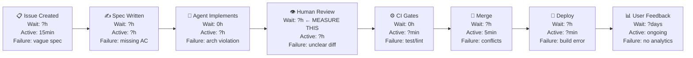

# Value Stream Map — [PROJECT NAME]

> DORA 2025 (VSM-01): "VSM acts as an AI force multiplier. By visualising your flow
> from idea to customer, you can identify where work waits and where friction exists.
> Without it, AI creates local optimisations that pile up work downstream."
>
> Complete before Phase 2 work begins. Review monthly.
> Instructions: For each step, record average wait time, active time, and primary failure reason
> from your last 10 PRs.

**Note:** unfilled cells ship as `—` (not measured yet) or `TBD by team`.
Replace both with your own numbers as you fill this in.

---

## Current Flow Map

---

## Step-by-Step Data

| Step             | Avg Wait Time      | Avg Active Time   | Primary Failure Reason      | AI Insertion Point           |
| ---------------- | ------------------ | ----------------- | --------------------------- | ---------------------------- |
| Issue Created    | —                  | 15 min            | Vague spec                  | PM uses Copilot to draft AC  |
| Spec Written     | —                  | —                 | Missing acceptance criteria | —                            |
| Agent Implements | 0 (async)          | —                 | Architecture violation      | Copilot implements from spec |
| Human Review     | **[MEASURE THIS]** | —                 | Unclear diff                | @verifier pre-screens        |
| CI Gates         | 0                  | [target: < 4 min] | Test failure                | Automated                    |
| Merge            | —                  | 5 min             | Merge conflict              | —                            |
| Deploy           | —                  | —                 | Build error                 | Automated                    |
| User Feedback    | —                  | ongoing           | No analytics                | —                            |

---

## Bottleneck Identification

**Current bottleneck:** _TBD by team — the step with the highest wait-to-active ratio._

**Evidence:** _TBD by team — data from the last 10 PRs._

**Root cause:** _TBD by team._

**Follow-up issue filed:** _TBD by team — link the issue once it exists._

---

## AI Insertion Points

Where Copilot currently adds value:

- _TBD by team._

Where Copilot currently creates friction:

- _TBD by team._

---

## Revision History

| Date          | Who  | What Changed        |
| ------------- | ---- | ------------------- |
| —             | [PM] | Initial map created |
